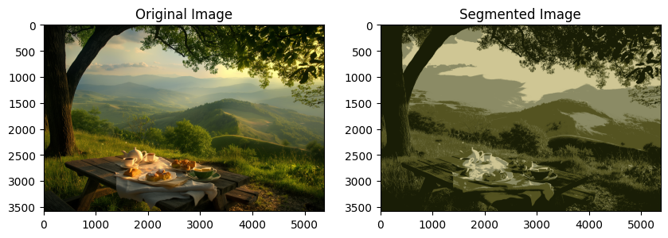
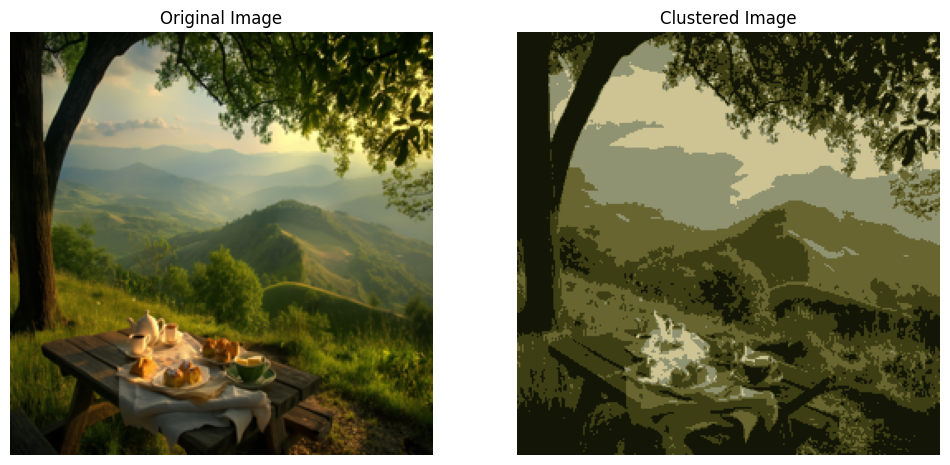
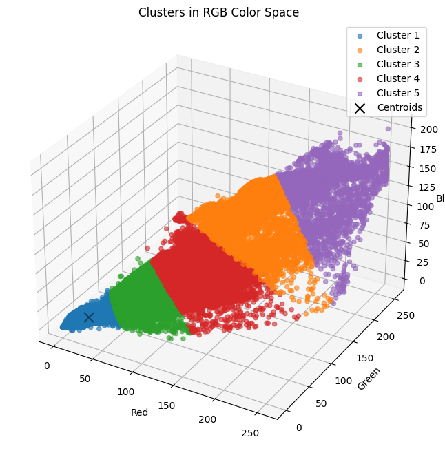

# Image Segmentation using k-means Clustering

## Project Description

This project demonstrates image segmentation using K-Means clustering. The goal is to segment an image into different regions based on color similarity, utilizing the K-Means clustering algorithm to group pixels with similar colors.

## Overview

The project involves the following steps:

1.  **Data Preparation**: Loading and preprocessing the image.

2.  **Clustering**: Applying K-Means clustering to segment the image.

3.  **Visualization**: Displaying the original and segmented images, and visualizing clusters in RGB color space.

## Data Description

The input is an image file that can be in various formats (JPEG, PNG, etc.). The image is processed to segment it into different regions based on color similarity.

## Features

-   **K-Means Clustering**: Utilizes the K-Means algorithm for segmenting the image.

-   **Visualization**: Displays the original and segmented images side-by-side, and visualizes the clusters in a 3D RGB color space.

## Prerequisites

-   Python 3.x

-   OpenCV

-   NumPy

-   Matplotlib

-   Scikit-Learn

-   PIL (Python Imaging Library)

To install these libraries use: pip install Scikit-Learn numpy matplotlib

## Usage

To run this script follow these steps:

Clone the repository or download the script to your local machine.

Open your terminal and navigate to the script's directory.

Run the script using Python.

## How It Works

1.  **Data Preparation**:

    -   Load the image using OpenCV or PIL.

    -   Convert the image to RGB format.

    -   Reshape the image to a 2D array of pixels.

2.  **Clustering**:

    -   Define criteria for K-Means clustering.

    -   Apply K-Means clustering to the pixel values.

    -   Replace pixel values with their corresponding cluster centers to create the segmented image.

3.  **Visualization**:

    -   Plot the original and segmented images.

    -   Visualize the clusters in a 3D RGB color space.

## Results

-   **Segmented Image**: The image is segmented into different regions based on color similarity.

-   **Cluster Visualization**: The clusters are visualized in a 3D RGB color space, showing how pixels are grouped.

### Plots

#### Original and Segmented Images

#### Clusters in RGB Color Space

## Conclusion

This project successfully demonstrates image segmentation using K-Means clustering. The segmented image highlights different regions based on color similarity, and the 3D plot provides a clear visualization of the clusters in RGB color space. This method can be extended to other applications such as object detection, image compression, and more.
